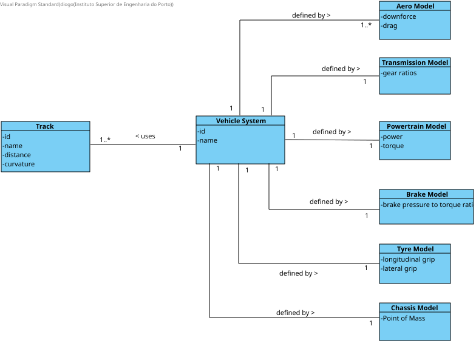
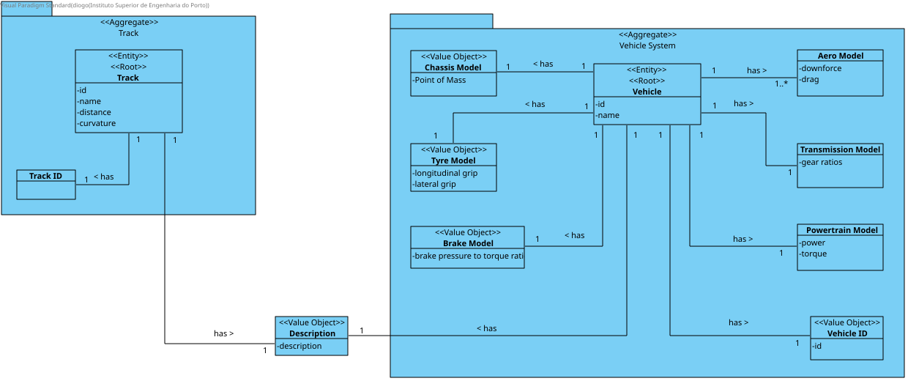

# Lap Time Simulator

## Development Structure
### First Stage - Basic Lap Time Simulator
To develop a single-point quasi-static lap time simulator, with the following parameters:
* Track
  * Curvature
  * Distance
* Vehicle
  * Chassis (defined by **mass**)
  * Tyre model (defined by **longitudinal grip** and **lateral grip**)
  * Aerodynamics (defined by **downforce** and **drag**)
  * Powertrain (defined by **power** and **torque**)
  * Transmission (defined by **gear ratios**)
  * Brakes (defined by **brake pressure to torque ratio**)

#### Domain Model

#### Aggregate Model
